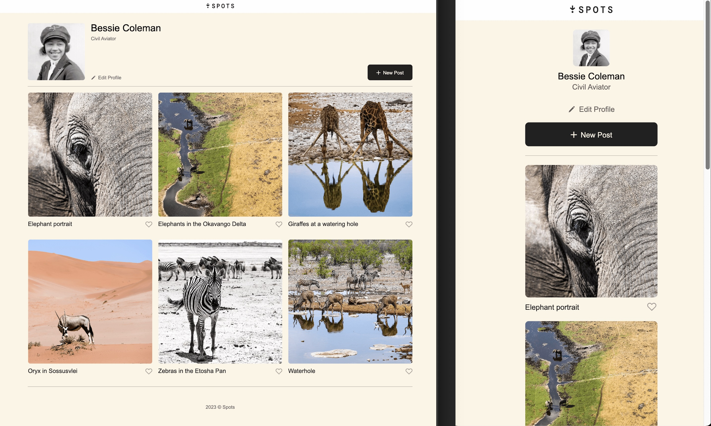

# Spots

### Project Overview

I have created an interactive social media web application where users can add and remove photos and make a few minor adjustments to their profile.

### Video Description

[https://drive.google.com/file/d/1qrmuy7TtP5WREHuDeJ9B1zJZkMrP6JqJ/view?usp=sharing](https://drive.google.com/file/d/1qrmuy7TtP5WREHuDeJ9B1zJZkMrP6JqJ/view?usp=sharing)

### Technologies Used

- Figma for design content
- HTML5 for structuring web content
- CSS3 and Media Queries for styling and ensuring responsiveness across different devices
- Flexbox and Grid for layout and adjustments

### Screenshots

### Link to my Project

[https://michelleoco.github.io/se_project_spots/](https://michelleoco.github.io/se_project_spots/)

### Plans for Future Improvements

- Create button functionality
