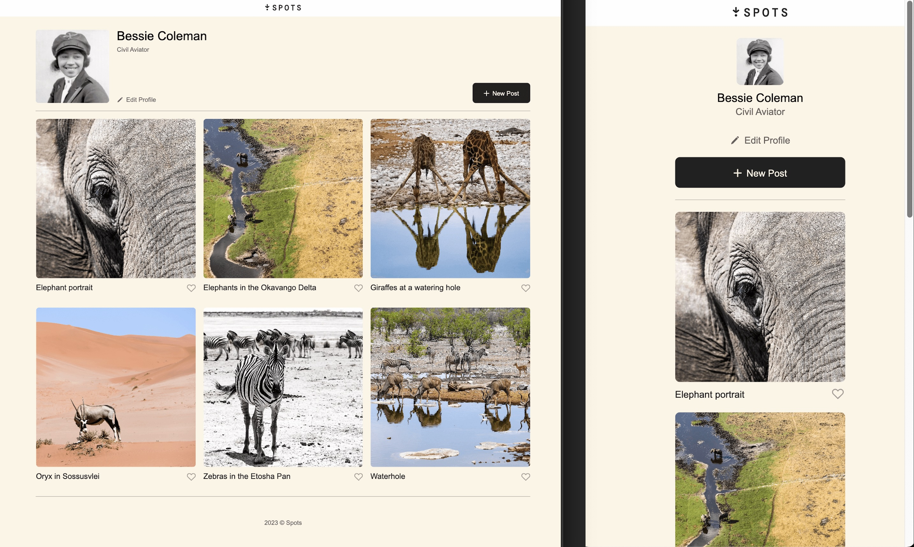

# Spots

_A social media app to share, like, and manage photos with friends._

## Table of Contents

- [Live Project](#live-project)
- [Introduction](#introduction)
- [Project Goals](#project-goals)
- [Features](#features)
- [Technologies](#technologies)
- [Project Structure](#project-structure)
- [API Integration](#api-integration)
- [Development Setup](#development-setup)
- [Build Process](#build-process)
- [Screenshots](#screenshots)
- [Future Improvements](#future-improvements)

---

## Live Project

**Domain:** [https://michelleoco.github.io/se_project_spots/](https://michelleoco.github.io/se_project_spots/)

---

## Introduction

**Spots** is an interactive social media web application that allows users to create personalized profiles, upload and describe photos, and engage with others by liking and unliking photos. The application connects to a backend API to provide persistent data storage and real-time functionality.

---

## Project Goals

- Develop an intuitive and engaging photo-sharing platform
- Enable users to manage their profiles and photo collections
- Facilitate social interactions through liking/unliking photos
- Ensure responsive design for a seamless experience on all devices
- Implement modern build tools and development workflow

---

## What Was Done

The project was built using **modern web technologies** and followed these key steps:

1. **UI/UX Design**

   - Created visual layouts and interactions using **Figma**.
   - Ensured responsive design through CSS Grid, Flexbox, and Media Queries.

2. **Frontend Development**

   - Structured content with **HTML5**.
   - Styled components for responsiveness and visual appeal using **CSS3**.
   - Added interactive functionality with **JavaScript**.

3. **Features Implementation**

   - User profiles with avatars, names, and descriptions.
   - Photo upload, deletion, and captioning.
   - Like and unlike functionality on photos.

4. **API Integration**

Integrates with a backend API to provide:

- User management: profile information and avatar updates
- Card operations: create, read, and delete photo cards
- Photo management: upload, deletion, and captioning
- Like system: toggle like/unlike status on photos
- Data persistence: all changes are saved to the server

---

## Features

- **User Profile Management**
  - Edit profile name and description
  - Update profile avatar
  - View personalized profile information
- **Photo Management**
  - Add new photos with captions
  - Delete owned photos with confirmation modal
  - View photos in full-screen preview mode
- **Social Interactions**
  - Like and unlike photos
  - Real-time like status updates
- **Responsive Design**
  - Mobile-first approach
  - Optimized for desktop and mobile devices
- **Form Validation**
  - Real-time input validation
  - User-friendly error messages

---

## Technologies

### Frontend

- **HTML5** – Semantic web structure with template elements
- **CSS3** – Modern styling with BEM methodology
- **JavaScript (ES6+)** – Dynamic functionality and API integration
- **CSS Grid & Flexbox** – Advanced layout management
- **Media Queries** – Responsive design implementation

### Build Tools & Development

- **Webpack 5** – Module bundling and asset management
- **Babel** – JavaScript transpilation for browser compatibility
- **PostCSS** – CSS processing and optimization
- **Autoprefixer** – Automatic vendor prefixes
- **CSS Nano** – CSS minification
- **Webpack Dev Server** – Development server with hot reload

### Backend Integration

- **REST API** – Integration with TripleTen's Around API
- **Fetch API** – HTTP requests for CRUD operations
- **Promise-based architecture** – Asynchronous data handling

---

## Screenshots

**Responsive views on desktop and mobile**  


---

## Future Improvements

- **User Authentication**: Implement secure login/logout functionality
- **Real-time Notifications**: Add notifications for likes and comments
- **Image Optimization**: Implement lazy loading and image compression
- **Infinite Scroll**: Add pagination for better performance with large datasets
- **Comments System**: Allow users to comment on photos
- **Search Functionality**: Enable searching for photos and users
- **Dark Mode**: Add theme switching capability

---

## Development Setup

**Prerequisites:**

- Node.js (v14 or higher)
- npm or yarn package manager

**Installation:**

```bash
# Clone the repository
git clone https://github.com/michelleoco/se_project_spots.git
cd se_project_spots

# Install dependencies
npm install

# Start development server
npm run dev
```

The development server will start at `http://localhost:8080` with hot reload enabled.

---

## Build Process

**Available Scripts:**

```bash
# Development server with hot reload
npm run dev

# Production build
npm run build

# Deploy to GitHub Pages
npm run deploy
```

**Build Features:**

- JavaScript transpilation with Babel
- CSS processing with PostCSS and Autoprefixer
- Asset optimization and minification
- Automatic HTML generation with webpack plugins
- Source maps for debugging
